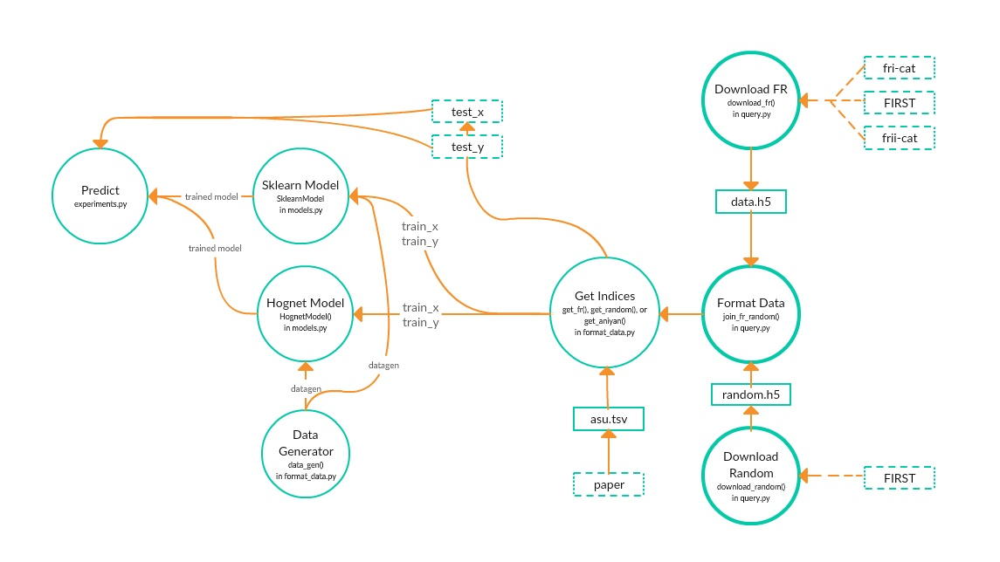

# thursday

Classifying radio galaxies as Fanaroff-Riley Type I (FR-I) and Fanaroff-Riley Type II (FR-II).

## Input files

You will need (for Aniyan vs FIRST FR classification). 
- The data used in https://arxiv.org/pdf/1705.03413.pdf. This is stored in `asu.tsv`.

## Running the code
To conduct all experiments, run experiments.py [`experiments.py`](thursday/experiments.py).

## Using the thursday API

0. Use `download_fr_components` in `query.py` to download all FRI/FRII samples in fri-cat, frii-cat, and FIRST to store as `data.h5`. Use `download_random` in `query.py` to download `n` random sources from FIRST to store as `random_path.h5`. 
1. With the `add_random` function in `format_data.py` to format and dump data from `output_path.h5` and `random_path.h5` into `everything.h5`. Labels are formated as Random=0, FRI=1, FRII=2.
2.1 FRI vs FRII: Use `get_fr` in `format_data.py` to generate the training and testing data indices from `everything.h5`.
2.2 FR vs Random: Use `get_random` in `format_data.py` to generate the training and testing data indices from `everything.h5`.
2.3 FRI vs FRII (testing on Aniyan): Use `get_aniyan` in `format_data.py` to generate the training and testing data indices from `everything.h5` and `asu.tsv`.
3. Open `everything.h5`  as `data` and use indices to select training and test images from `data['images']`. Get training and testing labels using `generate_labels` from `format_data` (or `generate_labels_fri` for FRI vs Random and `generate_labels_frii` for FRII vs Random).
4. Use the `augment` function in `format_data.py` to construct the data generator.
5. Instantiate the`HOGNnet` and/or `SklearnModel` from `models.py`. Both take `datagen` and `seed` as arguments. `SklearnModel` takes additional arguments like `Model` (the sklearn classifier being used), `nb_augment` (factor data is increased via augmentations), as well as any number of parameters specific to `Model`. `HOGNnet` takes `batch_size`, `steps_per_epoch`, `max_epoch`, and `patience` as additional arguments.
6. Use the `fit` method to train the model. Both have `train_x` and `train_y` as inputs.
7. Optional: If training times are long or you want to store your trained model, use the save method to save the model to disk (`SklearnModel` as a `.pk` file and `HOGnet` as a `.h5` file).
8. Optional: Load model from disk with the `load` method.
9. Use `predict` method to predict class labels and `predict_proba` class probabilities for unseen samples (`test_x`). Use `score` to evaluate the balanced accuracy of you model. 

## Example

A working example can be found at [`example_usage.ipynb`](thursday/example_usage.ipynb). 

